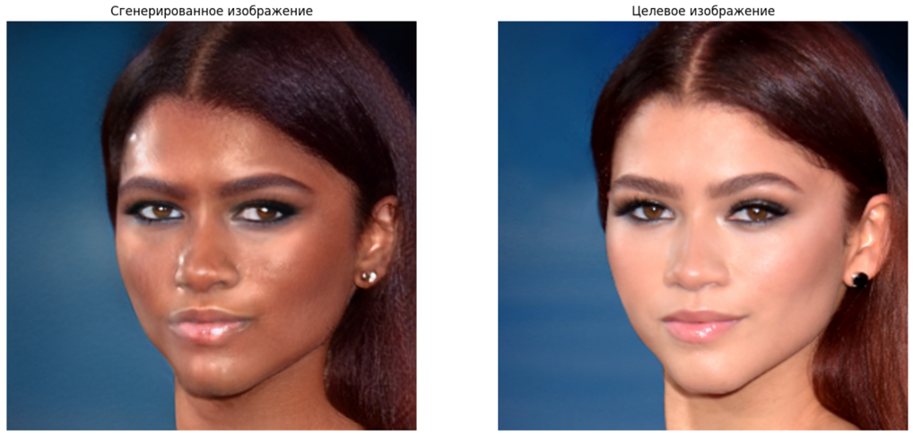

# Text-Face-Editing
Редактирование лица человека с помощью текстового промпта
## Принцип работы
1. Использование stylegan2 предобученного на датасете FFHQ (Facial Features High Quality)
2. Выравнивание изображения по 68 ключевым точкам лица для энкодера
3. Инверсия изображения с помощью предобученного энкодера
4. Дополнительная шумовая инверсия для более точной картинки
5. Оптимизация по текстовому промпту с помощью CLIP
## Использование
### Требования к промпту
1. Промпт должен быть на английском языке
2. Промпт должен описывать нужную картинку полностью, а не желаемую редакцию

    **Верно:** Bald man with metal glasses

    **Неверно:** Change his haircut to bald and add some glasses

### Аргументы
Для использования необходимо запустить `edit.py` с 2 необходимыми аргументами:
1. `--image-path "/folder/image.jpg"` или `-i "/folder/image.jpg"`
2. `--text "Editing text"` или `-t "Editing text"`
### Пример
`python edit.py -i "../data/zendaya.jpg" -t "woman with dark black skin"`

